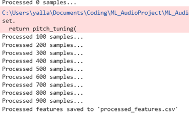
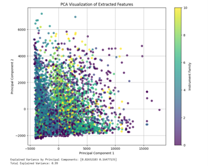
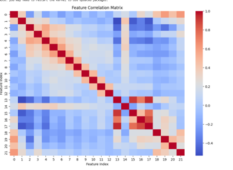
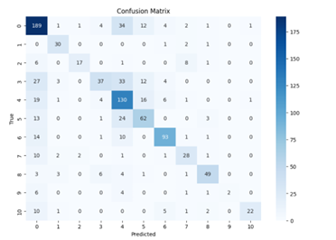
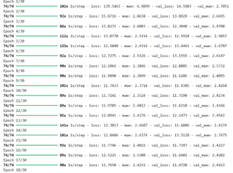
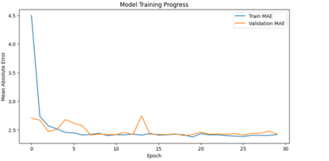
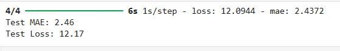
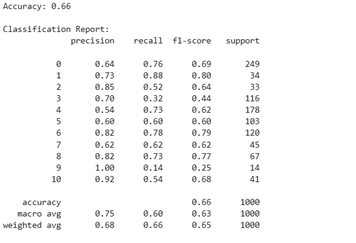
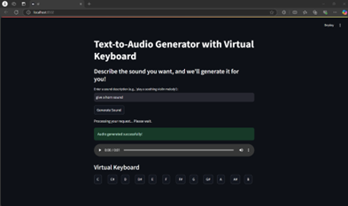
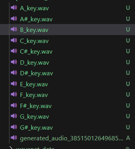

# AI-Driven Dynamic Music Synthesizer with Generative Sound Creation and Real-Time Manipulation

## Aim of the Project
The advent of machine learning and deep learning techniques has revolutionized audio synthesis, enabling the development of intelligent systems capable of generating audio based on user-provided textual descriptions. 

This project focuses on implementing a text-to-audio generation pipeline using a WaveNet-inspired model. The system converts textual descriptions into audio waveforms by extracting conditional features from the text and leveraging a deep learning-based generative model. The primary aim is to explore the integration of natural language processing (NLP) and audio generation techniques, contributing to fields like music composition, sound design, and accessibility tools.

## Key Features

* Text-to-Audio Generation: Generate custom audio waveforms from simple text prompts. The system uses a DistilBERT model to interpret text, such as "a loud horn sound," and synthesize the corresponding audio.
* Generative Sound Creation: At the core of the system is a WaveNet-inspired model that learns to produce high-fidelity audio from scratch. By training on a diverse dataset, it can create a wide range of instrument sounds.
* Real-Time Manipulation: A virtual keyboard interface allows for pitch-shifted playback of generated sounds, offering a dynamic way to experiment with the synthesized audio.
* User-Friendly Interface: An intuitive Streamlit interface makes it easy to input text descriptions and generate audio instantly.

## Implementation

### Data Processing and Feature Extraction
The system was trained on a subset of the NSynth dataset, which contains labeled audio samples of various instruments. The following features were extracted from the audio using the Librosa library:\

* Mel-frequency cepstral coefficients (MFCCs)
* Spectral centroid
* Chroma features
* Zero-crossing rate
* Other acoustic characteristics

This data was then preprocessed and used to train the generative model.

<table>
  <tr>
    <td>
      
      
Feature Extraction

    </td>
    <td>
      
      
PCA Graph

    </td>
  </tr>
  <tr>
    <td>
      
      
Feature Correlation

    </td>
    <td>
      
      
Confusion matrix

    </td>
  </tr>
</table>

### Model Architecture
The core of the project is a generative model based on the WaveNet architecture. This model uses dilated convolutional layers and residual connections to capture complex temporal patterns in audio data. It's designed to accept dual inputs: the audio waveform and conditional features extracted from text, allowing it to generate sounds with specific characteristics.

### Training and Testing
the model was trained using Mean Squared Error (MSE) as the loss function and Mean Absolute Error (MAE) as the evaluation metric. Early stopping mechanisms were employed to prevent overfitting, and learning curves were plotted to track the model's performance over time. The trained model was subsequently evaluated on unseen test data, with accuracy and loss metrics used to validate its generalization capabilities.

### NLP Integration
A pre-trained DistilBERT model was integrated to act as the NLP module. This model classifies text descriptions and maps them to the appropriate instrument families and conditional features. This allows the system to understand user requests and generate audio that matches their descriptions.

<table>
  <tr>
    <td>
      
      
Training Epochs

    </td>
    <td>
      
      
Training Graph

    </td>
  </tr>
  <tr>
    <td>
      
      
Testing Result

    </td>
    <td>
      
      
Audio Sample Classification

    </td>
  </tr>
</table>

### The Final System
The project brings these components together to form a powerful text-to-audio pipeline. Users can enter a prompt like "give me a loud horn sound" into the Streamlit interface. The system's NLP module processes the text, and the generative model synthesizes the corresponding audio waveform, which can then be played back. The virtual keyboard integration is designed to provide a more interactive way to use the generated sounds.

## Project Results
The project has shown promising results in generating high-quality audio from text. The model successfully learned to predict audio waveforms based on input features, achieving a Mean Absolute Error (MAE) of approximately 2.4 on the test set. The system correctly mapped text descriptions to instrument families and generated appropriate audio, demonstrating the potential of this integrated approach.

<table>
  <tr>
    <td>
      
      
Streamlit UI

    </td>
    <td>
      
      
Sound Generated

    </td>
  </tr>
</table>

Given Prompt: "give me a loud horn sound"\
The Genereted Audio: [Generated Audio](data/processed/processed_audio/generated_audio_3851501264968560703.wav)

The folder data/processed/processed_audio/ has all the pitch changes generated.

